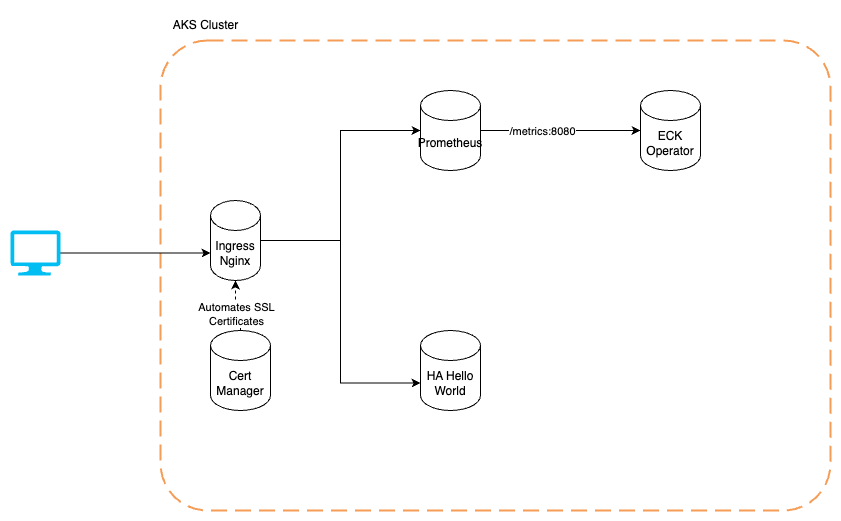

# AKS Cluster Infrastructure

## Overview

This documentation provides developers with an overview of the Kubernetes infrastructure deployed on Azure Kubernetes Service (AKS). The infrastructure is provisioned using Terraform, and application deployments are managed through ArgoCD.



## Deployed Components

### Kubernetes Cluster (AKS)
- Provisioned using Terraform.
- Includes Azure Resource Group, Networking, and basic IAM roles.
- Configured across multiple availability zones for high availability.

### ArgoCD
- Manually deployed to the `argocd` namespace.
- GitOps tool managing Kubernetes resources via ApplicationSets.
- Access ArgoCD UI:
```bash
kubectl port-forward svc/argocd-server -n argocd 8080:443
```
- Retrieve initial ArgoCD admin password:
```bash
kubectl -n argocd get secret argocd-initial-admin-secret -o jsonpath="{.data.password}" | base64 -d
```

### GitOps Managed Applications
- **Cert Manager**: Automates TLS certificate management.
- **Kube-Prometheus**: Monitoring stack including Prometheus and Grafana.
- **Ingress-Nginx**: Reverse proxy and load balancing for applications.
- **Elastic Cloud on Kubernetes (ECK) Operator**: Managed Elasticsearch clusters with monitoring enabled.
- **Hello World Application**: Demonstrates high availability and fault tolerance.

## Prometheus Monitoring
- Prometheus deployed using Kube-Prometheus operator.
- Metrics scraping enabled for ECK Operator.
- Prometheus UI publicly exposed via ingress.

## High Availability (HA)
- Hello World application deployed with topology spread constraints.
- Ensures pods are evenly distributed across AKS availability zones.

## Setting Up ArgoCD

### Installation
```bash
kubectl create namespace argocd
kubectl apply -n argocd -f https://raw.githubusercontent.com/argoproj/argo-cd/stable/manifests/install.yaml
```

### Accessing ArgoCD UI
```bash
kubectl port-forward svc/argocd-server -n argocd 8080:443
```

### Initial Login and Password Management
```bash
argocd admin initial-password -n argocd
argocd account update-password
```

### Creating ArgoCD Application
```bash
argocd app create cluster-bootstrap --repo https://github.com/josepperna/cluster-with-gitops.git --path argocd/apps --dest-server https://kubernetes.default.svc --dest-namespace default
```

## Useful Prometheus Queries
- **Node CPU Usage (%)**:
```promql
100 - (avg by (instance) (rate(node_cpu_seconds_total{mode="idle"}[5m])) * 100)
```

- **Node Memory Usage (%)**:
```promql
(1 - (node_memory_MemAvailable_bytes / node_memory_MemTotal_bytes)) * 100
```

- **Elastic Memory Used (Gb)**:
```promql
elastic_licensing_memory_gibibytes_total
```